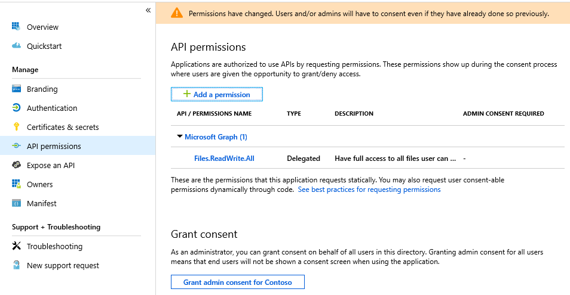

# Day 29 - Upload files to OneDrive and SharePoint

- [Prerequisites](#prerequisites)
- [Step 1: Update the App Registration permissions](#step-1-update-the-app-rgistration-permissions)
- [Step 2: Extend the app to yyy](#step-2-extend-the-app-to-yyy)
    - [Create the MyHelper class](#create-the-myhelper-class)
    - [Extend program to yyy](#extend-program-to-yyy)

## Prerequisites

To complete this sample you need the following:

- Complete the [Base Console Application Setup](../base-console-app/)
- [Visual Studio Community](https://visualstudio.microsoft.com/vs/community/) installed on your development machine. If you do not have Visual Studio Community edition (or another version of Visual Studio 2017), visit the previous link for download options. 
- Either a personal Microsoft account with a mailbox on Outlook.com, or a Microsoft work or school account.

If you don't have a Microsoft account, there are a couple of options to get a free account:

- You can [sign up for a new personal Microsoft account](https://signup.live.com/signup?wa=wsignin1.0&rpsnv=12&ct=1454618383&rver=6.4.6456.0&wp=MBI_SSL_SHARED&wreply=https://mail.live.com/default.aspx&id=64855&cbcxt=mai&bk=1454618383&uiflavor=web&uaid=b213a65b4fdc484382b6622b3ecaa547&mkt=E-US&lc=1033&lic=1).
- You can [sign up for the Office 365 Developer Program](https://developer.microsoft.com/office/dev-program) to get a free Office 365 subscription.

## Step 1: Prepare a new client application
1. Create a new blank Universal Windows application
1. Add the following NuGet packages
    1. Microsoft.Graph
    1. Microsoft.Identity.Client
1. Add the following using declarations to your MainPage.xaml.cs file:
```cs
    using Microsoft.Graph;
    using Microsoft.Identity.Client;
    using System.Threading.Tasks;
    using System.Net.Http.Headers;
    using Windows.Storage;
    using Windows.Storage.Pickers;
```
1. Below the MainPage constructor add the following code:
```cs
    private const string AADClientId = "YOURAPPIDHERE";
    private const string GraphAPIEndpointPrefix = "https://graph.microsoft.com/v1.0/";
    private string[] AADScopes = new string[] { "files.readwrite.all" };
    private PublicClientApplication AADAppContext = null;
    private GraphServiceClient graphClient = null;
    private AuthenticationResult userCredentials;
    public AuthenticationResult UserCredentials
    {
        get { return userCredentials; }
        set { userCredentials = value; }
    }
    public void InitializeGraph()
    {
        if (userCredentials != null)
        {
            graphClient = new GraphServiceClient(
                GraphAPIEndpointPrefix,
                new DelegateAuthenticationProvider(
                    async (requestMessage) =>
                    {
                        requestMessage.Headers.Authorization = new AuthenticationHeaderValue("bearer", userCredentials.AccessToken);
                    }
                )
            );
        }
    }

    /// <summary>
    /// Log the user in to either Office 365 or OneDrive consumer
    /// </summary>
    /// <returns>A task to await on</returns>
    public async Task<string> SignInUser()
    {
        string status = "Unknown";

        // Instantiate the app with AAD
        AADAppContext = new PublicClientApplication(AADClientId);

        try
        {
            UserCredentials = await AADAppContext.AcquireTokenAsync(AADScopes);
            if (UserCredentials != null)
            {
                status = "Signed in as " + UserCredentials.Account.Username;
                InitializeGraph();
            }
        }
        catch (MsalServiceException serviceEx)
        {
            status = $"Could not sign in, error code: " + serviceEx.ErrorCode;
        }
        catch (Exception ex)
        {
            status = $"Error Acquiring Token: {ex}";
        }

        return (status);
    }
```
1. Replace YOURAPPIDHERE with the id of your application created in the basic console application example

## Step 2: Update the App Registration permissions

As this exercise requires new permissions the App Registration needs to be updated to include the **Files.ReadWrite.All** permission using the new Azure AD Portal App Registrations UI (in preview as of the time of publish Nov 2018).

1. Open a browser and navigate to the [Preview App Registration](https://aka.ms/AppRegistrationsPreview) within Azure AD Portal. Login using a **personal account** (aka: Microsoft Account) or **Work or School Account** with permissions to create app registrations.

    > **Note:** If you do not have permissions to create app registrations contact your Azure AD domain administrators.

1. Click on the **.NET Core Graph Tutorial** item in the list

    > **Note:** If you used a different name while completing the [Base Console Application Setup](../base-console-app/) select that instead.

1. Click **API permissions** from the current blade content.

    1. Click **Add a permission** from the current blade content.
    1. On the **Request API permissions** flyout select **Microsoft Graph**.

        

    1. Select **Delegated permissions**.
    1. In the "Select permissions" search box type "Files.Read".
    1. Select **Files.ReadWrite.All** from the filtered list.

        

    1. Click **Add permissions** at the bottom of flyout.

## Step 3: Add upload functionality

In this step you will add methods to upload small and large files using two different techniques.

### Create the upload methods

1. Add the following code to your MainPage class for small file uploads:
```cs
    /// <summary>
    /// Take a file and upload it to the service
    /// </summary>
    /// <param name="fileToUpload">The file that we want to upload</param>
    /// <param name="uploadToSharePoint">Should we upload to SharePoint or OneDrive?</param>
    public async Task UploadSmallFile(StorageFile fileToUpload, bool uploadToSharePoint)
    {
        Stream fileStream = (await fileToUpload.OpenReadAsync()).AsStreamForRead();
        DriveItem uploadedFile = null;

        // Do we want OneDrive for Business/Consumer or do we want a SharePoint Site?
        if (uploadToSharePoint)
        {
            uploadedFile = await graphClient.Sites["root"].Drive.Root.ItemWithPath(fileToUpload.Name).Content.Request().PutAsync<DriveItem>(fileStream);
        }
        else
        {
            uploadedFile = await graphClient.Me.Drive.Root.ItemWithPath(fileToUpload.Name).Content.Request().PutAsync<DriveItem>(fileStream);
        }
    }
```
1. Add the following code to your MainPage class for large file uploads:
```cs
    /// <summary>
    /// Take a file greater than 4MB and upload it to the service
    /// </summary>
    /// <param name="fileToUpload">The file that we want to upload</param>
    /// <param name="uploadToSharePoint">Should we upload to SharePoint or OneDrive?</param>
    public async Task<DriveItem> UploadLargeFile(StorageFile fileToUpload, bool uploadToSharePoint)
    {
        Stream fileStream = (await fileToUpload.OpenReadAsync()).AsStreamForRead();
        DriveItem uploadedFile = null;
        UploadSession uploadSession = null;

        // Do we want OneDrive for Business/Consumer or do we want a SharePoint Site?
        if (uploadToSharePoint)
        {
            uploadSession = await graphClient.Sites["root"].Drive.Root.ItemWithPath(fileToUpload.Name).CreateUploadSession().Request().PostAsync();
        }
        else
        {
            uploadSession = await graphClient.Me.Drive.Root.ItemWithPath(fileToUpload.Name).CreateUploadSession().Request().PostAsync();
        }

        if(uploadSession != null)
        {
            // Chunk size must be divisible by 320KiB, our chunk size will be slightly more than 1MB
            int maxSizeChunk = (320 * 1024) * 4;
ChunkedUploadProvider uploadProvider = new ChunkedUploadProvider(uploadSession, graphClient, fileStream, maxSizeChunk);
            var chunkRequests = uploadProvider.GetUploadChunkRequests();
            var exceptions = new List<Exception>();
            var readBuffer = new byte[maxSizeChunk];
            foreach (var request in chunkRequests)
            {
                var result = await uploadProvider.GetChunkRequestResponseAsync(request, readBuffer, exceptions);

                if(result.UploadSucceeded)
                {
                    uploadedFile = result.ItemResponse;
                }
            }
        }

        return (uploadedFile);
    }
```

### Add some UX

1. Replace the default Grid element in your MainPage.xaml file with the following:
```xaml
    <RelativePanel>
        <RelativePanel RelativePanel.AlignHorizontalCenterWithPanel="True" RelativePanel.AlignVerticalCenterWithPanel="True">
            <CheckBox x:Name="uploadToSharePointCheckBox" Margin="10,10,10,10">Upload to SharePoint?</CheckBox>
            <Button x:Name="uploadSmallFileButton" Margin="10,10,10,10" Click="uploadSmallFileButton_Click" RelativePanel.Below="uploadToSharePointCheckBox" RelativePanel.AlignHorizontalCenterWithPanel="True">Upload small file</Button>
            <Button x:Name="uploadLargeFileButton" Margin="10,10,10,10" Click="uploadLargeFileButton_Click" RelativePanel.Below="uploadSmallFileButton" RelativePanel.AlignHorizontalCenterWithPanel="True">Upload large file</Button>
            <TextBlock x:Name="statusTextBlock" Margin="10,10,10,10" RelativePanel.Below="uploadLargeFileButton" RelativePanel.AlignHorizontalCenterWithPanel="True" />
        </RelativePanel>
    </RelativePanel>
```
1. In the code behind file (MainPage.xaml.cs) add the following code to add button handlers and connect the file picker:
```cs
    private async Task<StorageFile> PickFile()
    {
        var picker = new FileOpenPicker();
        picker.ViewMode = PickerViewMode.Thumbnail;
        picker.SuggestedStartLocation = PickerLocationId.PicturesLibrary;
        picker.FileTypeFilter.Add(".jpg");
        picker.FileTypeFilter.Add(".jpeg");
        picker.FileTypeFilter.Add(".png");

        StorageFile pickedFile = await picker.PickSingleFileAsync();
        return (pickedFile);
    }
    
    private async Task UploadFile(object whichButton)
    {
        if (this.UserCredentials == null)
        {
            await SignInUser();
        }

        StorageFile fileToUpload = await PickFile();
        DriveItem uploadedFile = null;

        if (whichButton == this.uploadSmallFileButton)
        {
            uploadedFile = await UploadSmallFile(fileToUpload);
        }
        else
        {
            uploadedFile = await UploadLargeFile(fileToUpload);
        }
        
        if (uploadedFile != null)
        {
            this.statusTextBlock.Text = "Uploaded file: " + uploadedFile.Name;
        }
        else
        {
            this.statusTextBlock.Text = "Upload failed";
        }
    }

    private async void uploadSmallFileButton_Click(object sender, RoutedEventArgs e)
    {
        await UploadFile(sender);            
    }

    private async void uploadLargeFileButton_Click(object sender, RoutedEventArgs e)
    {
        await UploadFile(sender);
    }

```

The application is now able to upload small or large files to either OneDrive or SharePoint.